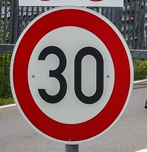
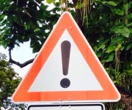
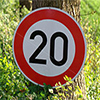
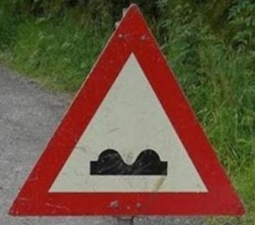
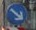
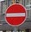
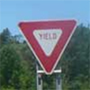

# **Traffic Sign Recognition** 

---

### Dataset Summary & Exploration

#### 1. Basic summary of the dataset.
* Dataset size:-
	* Training Set - **34799**
	* Test Set -**12630**
* Shape fo Traffic Sign image - **(32, 32, 3)**
* Number unique classes - **43**

#### 2. Visualization of the dataset.
Image samples from training dataset with label:- 

Below chart shows visualization of each dataset with respect to class of image:-  

| Training Dataset | Validation Dataset | Test Dataset |
| --------- | --------- | --------- |
| | |  |

### Design and Test a Model Architecture

#### 1. Preprocessing dataset

- Training data augmentation:-

	To increase the precision of the model I decided to augment the training dataset. The training data is augmented by using two techniques:-

	* Rotation and scaling:- 
		* Rotation: 10
		* scaling 1.25
	* Brigtness Augmentation:-
		* alpha:- 2.2
	
	After applying augmentation the total size of training dataset is **104397**
- Rgb to gray conversion:- 

	As color in traffic sign images unlikely to contribute in any information I decided to go with converting image to grayscale. But for natural images color gives extra information and converting to grayscale might result in loss of information.

- Normalizing datasets:- 

	To increase the performance of model further I applied normalization on grayscale images. Now datasets are ready for feeding to the neural network.

Samples from each dataset after rgb to gray conversion:-

Training Dataset:-

Validation Dataset:-

Test Dataset:-

Samples from each dataset after normalization:-

Training Dataset:-

Validation Dataset:-

Test Dataset:-

#### 2. Dataset information

Total number of samples in each dataset are
* Training dataset - **104397**
* Validation dataset - **4410**
* Test dataset - **12630**

#### 3. Final model architecture.

My final model consisted of the following layers:

| Layer         		|     Description	        						| 
|:---------------------:|:-------------------------------------------------:| 
| Input         		| 32x32x1 Grayscale image   						| 
| Convolution 5x5x6     	| 1x1 stride, 'VALID' padding, outputs 28x28x6 		|
| RELU					|													|
| Max pooling	      	| 2x2 stride,  outputs 14x14x6 						|
| Convolution 5x5x16	    | 1x1 stride, 'VALID' padding, outputs 10x10x16 	|
| RELU					|													|
| Max pooling	      	| 2x2 stride,  outputs 5x5x16 						|
| Flatten	        	| outputs 400 										|
| Fully connected		| outputs 120  										|
| RELU					|													|
| Dropout				| keep probability = 0.7 							|
| Fully connected		| outputs 84  										|
| RELU					|													|
| Dropout				| keep probability = 0.7							|
| Fully connected		| outputs 43 logits  								|

#### 4. Hyper Parameters.

To train the model, I used the following hyper parameters:

* Number of epochs = 14
* Batch size = 128
* Learning rate = 0.001
* Optimizer - Adam algorithm
* Dropout = 0.7 (for training set only)

#### 5. Approach taken for finding solution 

My final model results were:

* training set accuracy of **0.990**
* validation set accuracy of **0.961**
* test set accuracy of **0.935**

This solution based on modified LeNet-5 architecture. With the original LeNet-5 architecture, I've got a validation set accuracy of about 0.88.

Architecture adjustments steps:

* Perform preprocessing (grayscale and normalization). Results for training and validation sets on epoch #14 were 0.998 and 0.927 that's mean overfitting.
* Generate augmented training data. Results for training and validation sets on epoch #14 were 0.994 and 0.934 that's mean overfitting again.
* Dropout stage. To prevent neural network from overfitting. Results for training and validation sets on epoch #14 were around 0.990 and 0.961 (keep_prob values were in range 0.5-0.8).

### Test a Model on New Images

#### 1. Chosen images from web

Here are eight German traffic signs that I found on the web:

According to me these images have following difficulties in classification

| Image | Difficulty in classification |
|----------|-----------|
||Might be difficult to classify because background is splitted into two different parts and noisy background|
||Might be difficult to classify because sign is roated and noisy background|
||Might be difficult to classify because noisy background|
||Might be difficult to classify because  background is splitted into two different patterns and noisy background|
||Might be difficult to classify because sign is roated and noisy background|
||Might be difficult to classify because sign is roated and noisy background|
||Might be difficult to classify because noisy background|
||Might be difficult to classify because backgroud is splitted in two parts and noisy|

#### 2. Model's predictions on new traffic signs

Here are the results of the prediction:

The model was able to correctly guess 6 of the 8 traffic signs, which gives an accuracy of **100%**.

#### 3. Description of model output

For the **image #1**, the model is relatively sure that this is a Speed limit (30km/h) Sign, and the image does contain a Speed limit (30km/h) Sign. The top five soft max probabilities were:

* Labels: Speed limit (30km/h) = 1.0
* Labels: Speed limit (50km/h) = 1.655429393565555e-08
* Labels: Speed limit (20km/h) = 3.4416436367479264e-10
* Labels: Speed limit (70km/h) = 1.7803973898465608e-13
* Labels: Speed limit (80km/h) = 1.4284948075230126e-14

For the **image #2**, the model is relatively sure that this is a General caution Sign, and the image does contain a General caution Sign. The top five soft max probabilities were:

* Labels: General caution = 0.9999988079071045
* Labels: Pedestrians = 1.1849247130157892e-06
* Labels: Traffic signals = 2.3433452955856637e-09
* Labels: Right-of-way at the next intersection = 2.146497146693349e-10
* Labels: Speed limit (30km/h) = 1.962502155141571e-14

For the **image #3**, the model is relatively sure that this is a Speed limit (20km/h) Sign, and the image does contain a Speed limit (20km/h) Sign. The top five soft max probabilities were:

* Labels: Speed limit (20km/h) = 0.993358314037323
* Labels: Speed limit (30km/h) = 0.006471263710409403
* Labels: Keep right = 8.36258550407365e-05
* Labels: Speed limit (60km/h) = 5.417177817435004e-05
* Labels: Speed limit (120km/h) = 1.5603925930918194e-05

For the **image #4**, the model is relatively sure that this is a Bumpy road sign and the image does contain a Bumpy road sign. The top five soft max probabilities were:

* Labels: Bumpy road = 1.0
* Labels: Dangerous curve to the right = 1.0941588753738893e-13
* Labels: Road work = 1.381631545045866e-15
* Labels: Bicycles crossing = 4.6978601894783075e-16
* Labels: Traffic signals = 1.4005851910249916e-17

For the **image #5**, the model is relatively sure that this is a Stop sign and the image does contain a Stop sign. The top five soft max probabilities were:

* Labels: Stop = 1.0
* Labels: Speed limit (70km/h) = 1.396017612620426e-08
* Labels: Speed limit (30km/h) = 2.5873472253579166e-09
* Labels: Speed limit (50km/h) = 2.462374304457171e-09
* Labels: No entry = 2.259468168119838e-09

For the **image #6**, the model is relatively sure that this is a Keep right sign, and the image does contain a Keep right sign. The top five soft max probabilities were:

* Labels: Keep right = 1.0
* Labels: Go straight or right = 1.394781778138801e-13
* Labels: Turn left ahead = 8.70482952755082e-14
* Labels: Yield = 4.902779164638396e-14
* Labels: Road work = 1.3552798471309723e-16

For the **image #7**, the model is relatively sure that this is a No entry sign, and the image does contain a No entry sign. The top five soft max probabilities were:

* Labels: No entry = 1.0
* Labels: Stop = 5.913870196501414e-14
* Labels: Roundabout mandatory = 1.7527171662819196e-14
* Labels: Keep right = 3.740021303739956e-16
* Labels: Turn left ahead = 6.69838088376784e-17

For the **image #8**, the model is relatively sure that this is a Yield sign, and the image does contain a Yield sign. The top five soft max probabilities were:

* Labels: Yield = 1.0
* Labels: Ahead only = 8.727568667765695e-11
* Labels: Priority road = 4.155807642458598e-12
* Labels: Turn left ahead = 2.439685281054038e-14
* Labels: Keep right = 1.826894890791589e-14